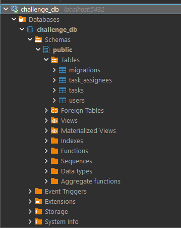
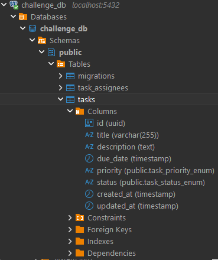
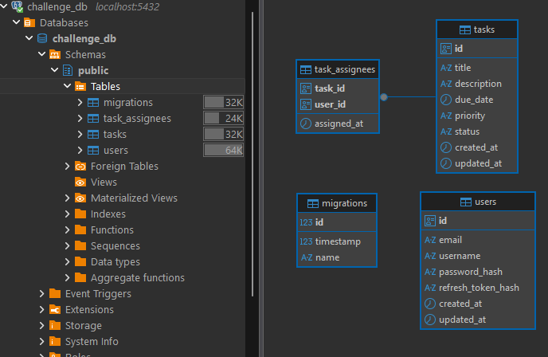
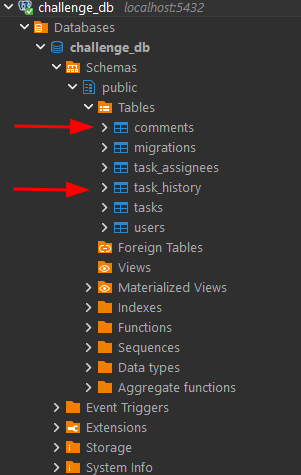
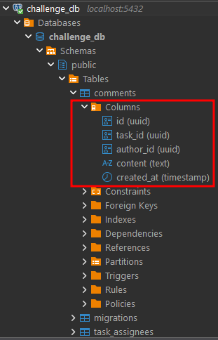
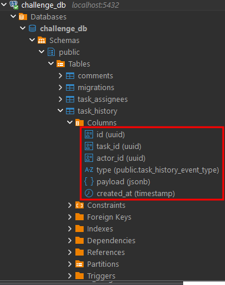
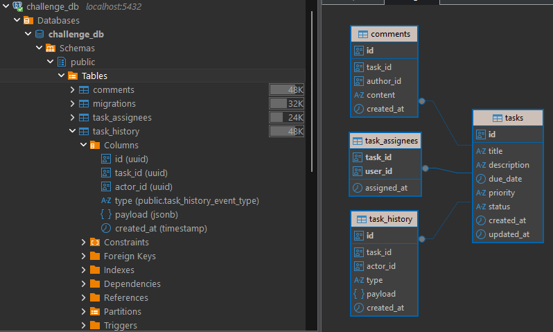

# 🧩 Jungle Gaming — Full-Stack Challenge (Monorepo)

Este repositório contém a implementação incremental do **Desafio Full-Stack da Jungle Gaming**.  
O objetivo é entregar um **sistema colaborativo de gestão de tarefas** composto por múltiplos serviços NestJS, um API Gateway, uma aplicação React e comunicação assíncrona via RabbitMQ.

> **Status atual (Fim do Dia 4):**
>
> - ✅ Infraestrutura Docker e Turborepo operacionais
> - ✅ Auth Service completo (cadastro, login, refresh token, bcrypt, TypeORM/Postgres)
> - ✅ API Gateway com proteção JWT, rate limiting, Swagger e rotas proxy para auth e tasks
> - ✅ Tasks Service com CRUD completo de tarefas + paginação, validações rigorosas e migrations
> - ⏳ Notificações, comentários, histórico e frontend em desenvolvimento (Dias 5+)

---

## 🏗️ Arquitetura

```
                       ┌──────────────┐
                       │   Web (WIP)  │
                       └──────┬───────┘
                              │ HTTP (JWT)
                      ┌───────▼────────┐
                      │  API Gateway   │  Swagger → http://localhost:3001/api/docs
                      └───────▲────────┘
                          HTTP│
┌──────────────────────────────┼─────────────────────────────┐
│        Serviços internos NestJS + Postgres + RabbitMQ      │
│  ┌─────────────┐    ┌────────────────┐       ┌───────────┐ │
│  │ Auth Service│    │ Tasks Service  │       │ Notifications│ (backlog)
│  └──────┬──────┘    └───────┬────────┘       └───────┬───┘ │
│         │ JWT & Users       │ CRUD + Assignees         │    │
│         │                   │                          │    │
│      ┌──▼──┐            ┌───▼───┐                 ┌────▼──┐ │
│      │ DB  │◄───────────┤ Tables│                 │RabbitMQ│ │
│      └─────┘            └───────┘                 └───────┘ │
└─────────────────────────────────────────────────────────────┘
```

---

## ⚙️ Stack Técnica

- **Monorepo & DevX:** Turborepo, npm workspaces, TypeScript 5, ESLint, Prettier
- **Backend:** NestJS 11, TypeORM 0.3, PostgreSQL 17, Docker Compose
- **Banco de Dados & Ferramentas:** PostgreSQL (via Docker) + DBeaver (inspeção visual do schema e dados)
- **Infra complementar:** RabbitMQ 3 (management UI), Swagger/OpenAPI via Nest
- **Frontend:** React + TanStack Router + Tailwind + shadcn/ui (a partir do Dia 7)

---

## 🚀 Como Rodar o Projeto

### 1️⃣ Pré-requisitos

- Docker + Docker Compose
- Node.js 20+ (para scripts locais e migrations)

---

### 2️⃣ Instalação

```bash
npm install
```

---

### 3️⃣ Variáveis de ambiente

Cada app possui um `.env.example`.  
Copie-o para `.env`:

```bash
cp apps/<app>/.env.example apps/<app>/.env
```

Valores padrão (local/dev) já funcionam com o `docker-compose.yml` presente na raiz.

- `apps/tasks-service/.env` agora traz `TASKS_EVENTS_EXCHANGE` (default `tasks.events`) apontando para o exchange usado nos eventos de tarefas.

---

### 4️⃣ Subir toda a stack

```bash
docker compose up --build
```

**Serviços expostos:**

| Serviço              | Porta | URL                                  |
| -------------------- | ----- | ------------------------------------ |
| Web (WIP)            | 3000  | http://localhost:3000                |
| API Gateway          | 3001  | http://localhost:3001                |
| Swagger (Gateway)    | —     | http://localhost:3001/api/docs       |
| Auth Service         | 3002  | http://localhost:3002                |
| Tasks Service        | 3003  | http://localhost:3003                |
| Notifications (stub) | 3004  | http://localhost:3004                |
| RabbitMQ UI          | 15672 | http://localhost:15672 (admin/admin) |

---

### 5️⃣ Rodar migrations

Após a stack estar de pé, execute:

```bash
# Auth
docker compose exec auth-service npm run migration:run --workspace=@jungle/auth-service

# Tasks
docker compose exec tasks-service npm run migration:run --workspace=@jungle/tasks-service
```

---

### 6️⃣ Checagens locais (opcional)

```bash
npm run typecheck --workspace=@jungle/tasks-service
npm run build --workspace=@jungle/tasks-service
```

---

## 🔐 Fluxo Implementado até o Momento

### Autenticação

| Endpoint                  | Via Gateway | Descrição                     |
| ------------------------- | ----------- | ----------------------------- |
| `POST /api/auth/register` | ✅          | Cria usuário + retorna tokens |
| `POST /api/auth/login`    | ✅          | Autentica e retorna tokens    |
| `POST /api/auth/refresh`  | ✅          | Atualiza access token         |

- Hash de senha com bcrypt (`BCRYPT_SALT_ROUNDS`, default 10)
- JWT Access (15 min) e Refresh (7 dias)
- Refresh token armazenado como hash no banco (`users.refresh_token_hash`)

**Testar via Swagger:**

1. Acesse http://localhost:3001/api/docs
2. Registre um usuário
3. Faça login e obtenha os tokens
4. Clique em **Authorize** e insira `Bearer <accessToken>`
5. Teste as rotas de Tasks autenticadas

---

### Tasks Service (Dias 4 e 5)

| Endpoint                        | Protegido | Observações                                                                                        |
| ------------------------------- | --------- | -------------------------------------------------------------------------------------------------- |
| `GET /api/tasks`                | ✅        | Paginação (`page`, `size`), ordenação desc por criação                                             |
| `POST /api/tasks`               | ✅        | Valida título, status, prioridade, `assigneeIds` únicos; registra histórico e publica evento       |
| `GET /api/tasks/{id}`           | ✅        | Usa `ParseUUIDPipe`; inclui `X-User-Id` para auditoria                                             |
| `PUT /api/tasks/{id}`           | ✅        | Transação + diff de alterações; histórico `TASK_UPDATED`; evento `task.updated`                    |
| `DELETE /api/tasks/{id}`        | ✅        | Remove tarefa (cascade em assignees)                                                               |
| `GET /api/tasks/{id}/comments`  | ✅        | Lista comentários com paginação (`page`, `size`) e ordenação desc por `createdAt`                  |
| `POST /api/tasks/{id}/comments` | ✅        | Cria comentário usando o usuário autenticado (`X-User-Id`) como autor; histórico `COMMENT_CREATED` |

Regras principais e integrações:

- `assigneeIds` deduplicados → duplicatas geram 400.
- Todas as operações críticas ocorrem dentro de transações TypeORM (consistência entre `tasks`, `task_assignees`, `comments` e `task_history`).
- `X-User-Id` é propagado pelo Gateway (valor do `sub` no JWT) e utilizado como `actorId` e `authorId` no tasks-service.
- `task_history` registra `TASK_CREATED`, `TASK_UPDATED` (com `changedFields`) e `COMMENT_CREATED`.
- Respostas de listagem padronizadas: `{ data, page, size, total }`.

### RabbitMQ & Eventos

- Exchange padrão: `tasks.events` (configurável via `TASKS_EVENTS_EXCHANGE`).
- Eventos publicados:
  - `task.created`
  - `task.updated`
  - `task.comment.created`
- Payload inclui `actorId` quando disponível e snapshots normalizados (datas em ISO 8601 / UTC).
- **Inspecionar rapidamente via CLI:**

  ```bash
  # criar fila efêmera e bindar todos os eventos
  docker compose exec rabbitmq rabbitmqadmin -u admin -p admin declare queue name=debug-tasks-events durable=false
  docker compose exec rabbitmq rabbitmqadmin -u admin -p admin declare binding source=tasks.events destination=debug-tasks-events routing_key='#'

  # consumir mensagens
  docker compose exec rabbitmq rabbitmqadmin -u admin -p admin get queue=debug-tasks-events count=10

  # remover fila ao terminar
  docker compose exec rabbitmq rabbitmqadmin -u admin -p admin delete queue name=debug-tasks-events
  ```

- Notifications/WebSocket permanecem planejados para o Dia 6.

---

## ⚖️ Decisões & Trade-offs

- **Monorepo via Turborepo:** facilita o compartilhamento de tipos/utilitários e builds encadeados
- **TypeORM + migrations:** garante versionamento e evita `synchronize` em produção
- **Validações agressivas:** erros 400 antecipam falhas de negócio e evitam 500 genéricos
- **Swagger:** substitui Postman e documenta automaticamente os endpoints

---

## 📊 Evolução do Banco de Dados (Dias 4 → 5)

> Evidências capturadas via DBeaver (modo escuro) mostrando a evolução do schema PostgreSQL `challenge_db`.

---

## 🗓️ DIA 4 – Estrutura Base

### 🖼️ **Figura 1 – Estrutura geral do banco (Dia 4)**

Visão geral das tabelas criadas até o final do Dia 4 (`users`, `tasks`, `task_assignees`, `migrations`).



---

### 🖼️ **Figura 2 – Estrutura detalhada da tabela `tasks`**

Campos e tipos da tabela principal de tarefas, incluindo enums de prioridade e status.



---

### 🖼️ **Figura 3 – Estrutura detalhada da tabela `users`**

Tabela de usuários com credenciais seguras (hash de senha e refresh token).


---

### 🖼️ **Figura 4 – Relações entre tabelas (ER Diagram – Dia 4)**

Diagrama Entidade-Relacionamento (ER) gerado automaticamente pelo DBeaver.  
Mostra as relações entre `tasks`, `users`, `task_assignees` e `migrations`.



---

### 🖼️ **Figura 5 – Swagger (Dia 4)**

Documentação dos endpoints antes da inclusão de comentários e eventos.


---

## 🗓️ DIA 5 – Comentários, Histórico e Eventos

Com a implementação do **Tasks Service (Parte 2)**, o banco foi expandido para incluir comentários e histórico de eventos.  
As novas tabelas `comments` e `task_history` suportam o registro de interações e auditoria no contexto das tarefas.

| Nova Tabela    | Descrição                                                          | Relações                                   |
| -------------- | ------------------------------------------------------------------ | ------------------------------------------ |
| `comments`     | Armazena comentários de usuários em tarefas.                       | `task_id → tasks.id`, `user_id → users.id` |
| `task_history` | Registra eventos de auditoria (criação, atualização, comentários). | `task_id → tasks.id`                       |

---

### 🖼️ **Figura 6 – Swagger (Dia 5)**

Swagger com os novos endpoints de comentários e descrições atualizadas.


---

### 🖼️ **Figura 7 – Estrutura geral do banco (Dia 5)**

Visão atualizada do schema `challenge_db` após as migrations do Dia 5.  
Mostra as novas tabelas `comments` e `task_history` integradas ao conjunto existente (`tasks`, `users`, `task_assignees`).



---

### 🖼️ **Figura 8 – Estrutura detalhada da tabela `comments`**

Campos da tabela `comments`, incluindo o relacionamento com a tarefa (`task_id`) e o autor (`author_id`), além do conteúdo e data de criação.



---

### 🖼️ **Figura 9 – Estrutura detalhada da tabela `task_history`**

Tabela de histórico de eventos (`task_history`) com os campos `actor_id`, `type`, `payload` e `created_at`.  
Usada para auditoria e registro de alterações ou comentários em tarefas.



---

### 🖼️ **Figura 10 – Relações entre tabelas (ER Diagram – Dia 5)**

Diagrama Entidade-Relacionamento atualizado, mostrando as conexões entre todas as tabelas (`users`, `tasks`, `comments`, `task_history`, `task_assignees`, `migrations`).  
Evidencia a evolução do schema após o Dia 5, com as novas entidades conectadas ao modelo existente.



---

📌 **Autor:** [Bruno Macedo](https://github.com/brunomacedo1203)  
📆 **Progresso:** Implementação incremental (Dias 1–10)  
🧠 **Propósito:** Reproduzir um ambiente profissional de desenvolvimento full-stack com foco em arquitetura limpa, versionamento e documentação técnica.
