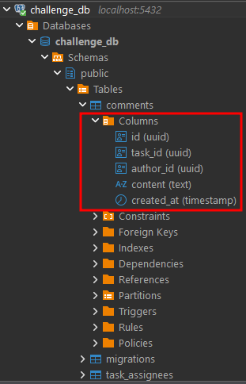
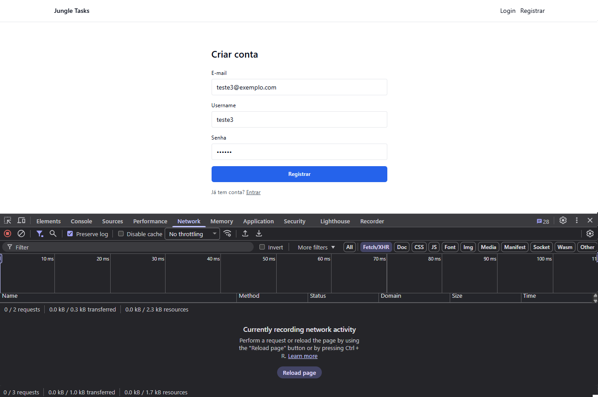

# 🧩 Jungle Gaming — Full-Stack Challenge (Monorepo)

Este repositório contém a implementação incremental do **Desafio Full-Stack da Jungle Gaming**.  
O objetivo é entregar um **sistema colaborativo de gestão de tarefas** composto por múltiplos serviços NestJS, um API Gateway, uma aplicação React e comunicação assíncrona via RabbitMQ.

> **Status atual (Fim do Dia 6):**
>
> - ✅ Infraestrutura Docker e Turborepo operacionais
> - ✅ Auth Service completo (cadastro, login, refresh token, bcrypt, TypeORM/Postgres)
> - ✅ API Gateway com proteção JWT, rate limiting, Swagger e rotas proxy para auth e tasks
> - ✅ Tasks Service com CRUD completo de tarefas, comentários, histórico, paginação e migrations
> - ✅ Notifications Service consumindo eventos via RabbitMQ e emitindo WebSocket em tempo real
> - ⏳ Frontend em desenvolvimento (a partir do Dia 7)

---

## 🏗️ Arquitetura

```
                       ┌──────────────┐
                       │   Web (WIP)  │
                       └──────┬───────┘
                              │ HTTP (JWT)
                      ┌───────▼────────┐
                      │  API Gateway   │  Swagger → http://localhost:3001/api/docs
                      └───────▲────────┘
                          HTTP│
┌──────────────────────────────┼─────────────────────────────┐
│        Serviços internos NestJS + Postgres + RabbitMQ      │
│  ┌─────────────┐    ┌────────────────┐       ┌───────────┐ │
│  │ Auth Service│    │ Tasks Service  │       │ Notifications │
│  └──────┬──────┘    └───────┬────────┘       └───────┬───┘ │
│         │ JWT & Users       │ CRUD + Assignees         │    │
│         │                   │                          │    │
│      ┌──▼──┐            ┌───▼───┐                 ┌────▼──┐ │
│      │ DB  │◄───────────┤ Tables│                 │RabbitMQ│ │
│      └─────┘            └───────┘                 └───────┘ │
└─────────────────────────────────────────────────────────────┘
```

---

## ⚙️ Stack Técnica

- **Monorepo & DevX:** Turborepo, npm workspaces, TypeScript 5, ESLint, Prettier
- **Backend:** NestJS 11, TypeORM 0.3, PostgreSQL 17, Docker Compose
- **Banco de Dados & Ferramentas:** PostgreSQL (via Docker) + DBeaver (inspeção visual do schema e dados)
- **Infra complementar:** RabbitMQ 3 (management UI), Swagger/OpenAPI via Nest
- **Frontend:** React + TanStack Router + Tailwind + shadcn/ui (a partir do Dia 7)

### IDs e Migrations (Convenção)

- IDs primários agora são gerados pelo banco via `@PrimaryGeneratedColumn('uuid')`.
- As migrations habilitam `uuid-ossp` e definem `DEFAULT uuid_generate_v4()` para as colunas `id`.
- Com isso, é seguro usar tanto `save()` quanto `insert()` nas operações do TypeORM.
- Ver diretrizes em `CONTRIBUTING.md`.

---

## 🚀 Como Rodar o Projeto

### 1️⃣ Pré-requisitos

- Docker + Docker Compose
- Node.js 20+ (para scripts locais e migrations)

---

### 2️⃣ Instalação

```bash
npm install
```

---

### 3️⃣ Variáveis de ambiente

Cada app possui um `.env.example`.  
Copie-o para `.env`:

```bash
cp apps/<app>/.env.example apps/<app>/.env
```

Valores padrão (local/dev) já funcionam com o `docker-compose.yml` presente na raiz.

- `apps/tasks-service/.env` expos `TASKS_EVENTS_EXCHANGE` (default `tasks.events`).
- `apps/notifications-service/.env` define `RABBITMQ_URL`, `TASKS_EVENTS_EXCHANGE`, `NOTIFS_QUEUE`, `PORT`, `JWT_ACCESS_SECRET` e `MIGRATIONS_RUN=true` (para aplicar migrations automaticamente no boot).
- `apps/auth-service/.env` também traz `MIGRATIONS_RUN=true`, garantindo que as migrations de UUID sejam aplicadas ao subir via Docker.

---

### 4️⃣ Subir toda a stack

```bash
docker compose up --build
```

**Serviços expostos:**

| Serviço               | Porta | URL                                  |
| --------------------- | ----- | ------------------------------------ |
| Web (WIP)             | 3000  | http://localhost:3000                |
| API Gateway           | 3001  | http://localhost:3001                |
| Health (Gateway)      | —     | http://localhost:3001/api/health     |
| Swagger (Gateway)     | —     | http://localhost:3001/api/docs       |
| Auth Service          | 3002  | http://localhost:3002                |
| Tasks Service         | 3003  | http://localhost:3003                |
| Health (Tasks)        | —     | http://localhost:3003/health         |
| Notifications Service | 3004  | http://localhost:3004                |
| Health (Notifs)       | —     | http://localhost:3004/health         |
| RabbitMQ UI           | 15672 | http://localhost:15672 (admin/admin) |

---

Nota de segurança: os microserviços internos (Auth, Tasks e Notifications) não expõem mais portas públicas no Docker Compose. A comunicação externa deve ocorrer apenas via API Gateway. Para depuração direta, use `docker compose exec` dentro dos containers ou acesse pelos nomes de host internos da rede do Compose.

### 5️⃣ Rodar migrations

Após a stack estar de pé, execute:

```bash
# Auth
docker compose exec auth-service npm run migration:run --workspace=@jungle/auth-service

# Tasks
docker compose exec tasks-service npm run migration:run --workspace=@jungle/tasks-service

# Notifications
docker compose exec notifications-service npm run migration:run --workspace=@jungle/notifications-service

Observação: novas migrations foram adicionadas para padronizar IDs em UUID gerados pelo banco (Auth e Tasks).
Se estiver usando o `docker compose up`, os serviços de Auth e Notifications já estão configurados com `MIGRATIONS_RUN=true` e executam as migrations automaticamente no boot — rode manualmente apenas se estiver trabalhando fora dos containers.
```

---

### 6️⃣ Checagens locais (opcional)

```bash
npm run typecheck --workspace=@jungle/tasks-service
npm run build --workspace=@jungle/tasks-service

# Health endpoints
curl -sfS http://localhost:3001/api/health
curl -sfS http://localhost:3003/health
curl -sfS http://localhost:3004/health
```

---

## 🔐 Fluxo Implementado até o Momento

### Autenticação

| Endpoint                  | Via Gateway | Descrição                     |
| ------------------------- | ----------- | ----------------------------- |
| `POST /api/auth/register` | ✅          | Cria usuário + retorna tokens |
| `POST /api/auth/login`    | ✅          | Autentica e retorna tokens    |
| `POST /api/auth/refresh`  | ✅          | Atualiza access token         |

- Hash de senha com bcrypt (`BCRYPT_SALT_ROUNDS`, default 10)
- JWT Access (15 min) e Refresh (7 dias)
- Refresh token armazenado como hash no banco (`users.refresh_token_hash`)

**Testar via Swagger:**

1. Acesse http://localhost:3001/api/docs
2. Registre um usuário
3. Faça login e obtenha os tokens
4. Clique em **Authorize** e insira `Bearer <accessToken>`
5. Teste as rotas de Tasks autenticadas

—

### CORS e Rate-limit (Gateway)

O Gateway agora aceita configuração via `.env`:

- `CORS_ORIGIN`: lista separada por vírgulas de origens permitidas (ou `*`). Ex.: `http://localhost:3000,http://127.0.0.1:3000`.
- `CORS_CREDENTIALS`: `true`/`false`.
- `THROTTLE_TTL`: janela (segundos) para rate-limit.
- `THROTTLE_LIMIT`: requisições por janela.

Veja `apps/api-gateway/.env.example` para valores padrão.

### Notificações HTTP autenticadas

`GET /notifications` no notifications-service agora requer JWT e deriva o `recipientId` do token:

```
curl -H "Authorization: Bearer $ACCESS_TOKEN" "http://localhost:3004/notifications?size=10"
```

—

### Front-end: WebSocket e Auto-refresh de Token

- O front conecta ao WS usando `VITE_WS_URL` (ex.: `ws://localhost:3004`).
- Ao receber 401 das APIs, o front tenta `POST /auth/refresh` via Gateway e reexecuta a requisição original.
- Notificações em tempo real exibem toasts e um badge de "não lidas" (máx. 10) no cabeçalho.

---

### Tasks Service (Dias 4 e 5)

| Endpoint                        | Protegido | Observações                                                                                        |
| ------------------------------- | --------- | -------------------------------------------------------------------------------------------------- |
| `GET /api/tasks`                | ✅        | Paginação (`page`, `size`), ordenação desc por criação                                             |
| `POST /api/tasks`               | ✅        | Valida título, status, prioridade, `assigneeIds` únicos; registra histórico e publica evento       |
| `GET /api/tasks/{id}`           | ✅        | Usa `ParseUUIDPipe`; inclui `X-User-Id` para auditoria                                             |
| `PUT /api/tasks/{id}`           | ✅        | Transação + diff de alterações; histórico `TASK_UPDATED`; evento `task.updated`                    |
| `DELETE /api/tasks/{id}`        | ✅        | Remove tarefa (cascade em assignees)                                                               |
| `GET /api/tasks/{id}/comments`  | ✅        | Lista comentários com paginação (`page`, `size`) e ordenação desc por `createdAt`                  |
| `POST /api/tasks/{id}/comments` | ✅        | Cria comentário usando o usuário autenticado (`X-User-Id`) como autor; histórico `COMMENT_CREATED` |

Regras principais e integrações:

- `assigneeIds` deduplicados → duplicatas geram 400.
- Todas as operações críticas ocorrem dentro de transações TypeORM (consistência entre `tasks`, `task_assignees`, `comments` e `task_history`).
- `X-User-Id` é propagado pelo Gateway (valor do `sub` no JWT) e utilizado como `actorId` e `authorId` no tasks-service.
- `task_history` registra `TASK_CREATED`, `TASK_UPDATED` (com `changedFields`) e `COMMENT_CREATED`.
- Respostas de listagem padronizadas: `{ data, page, size, total }`.

### RabbitMQ & Eventos

- Exchange padrão: `tasks.events` (configurável via `TASKS_EVENTS_EXCHANGE`).
- Eventos publicados:
  - `task.created`
  - `task.updated`
  - `task.comment.created`
- Payload inclui `actorId` quando disponível e snapshots normalizados (datas em ISO 8601 / UTC).
- **Inspecionar rapidamente via CLI:**

  ```bash
  # criar fila efêmera e bindar todos os eventos
  docker compose exec rabbitmq rabbitmqadmin -u admin -p admin declare queue name=debug-tasks-events durable=false
  docker compose exec rabbitmq rabbitmqadmin -u admin -p admin declare binding source=tasks.events destination=debug-tasks-events routing_key='#'

  # consumir mensagens
  docker compose exec rabbitmq rabbitmqadmin -u admin -p admin get queue=debug-tasks-events count=10

  # remover fila ao terminar
  docker compose exec rabbitmq rabbitmqadmin -u admin -p admin delete queue name=debug-tasks-events
  ```

- Notifications/WebSocket implementados no Dia 6 (ver seção abaixo para detalhes do WS e testes com wscat).

### Notifications Service & WebSocket (Dia 6)

- Health-check: `GET http://localhost:3004/health`
- Consumer RabbitMQ:
  - Fila padrão `NOTIFS_QUEUE=notifications.q` (durável) com `prefetch(10)` e ACK manual
  - Bind no exchange `tasks.events` usando padrão `task.#` (suporta múltiplos padrões via `,`)
  - Payloads validados com tipos de `packages/types`; mensagens inválidas recebem NACK para a DLQ (opcional)
- Persistência:
  - Upsert de participantes por tarefa (`task_participants`), evitando notificar o próprio autor
  - Tabela `notifications` (`id`, `recipient_id`, `type`, `task_id`, `comment_id`, `title`, `body`, `read_at`, `created_at`)
  - Índices em `(recipient_id, read_at)` e `(recipient_id, created_at DESC)` para listagem rápida
- WebSocket gateway em `ws://localhost:3004/ws?token=<JWT>` (usa `JWT_ACCESS_SECRET`) com limpeza de sockets por usuário em `disconnect`
- Eventos emitidos aos destinatários conectados:
  - `task:created`
  - `task:updated`
  - `comment:new`
- Sincronização inicial: ao conectar, o serviço envia as últimas notificações não lidas (`notification:unread`, limite padrão 10)
- API auxiliar `GET /notifications?page=&size=` (JWT requerido) para teste/local; `size` é opcional graças ao `ParseIntPipe({ optional: true })`
- Observabilidade: logs estruturados por `routingKey` e métricas básicas para QA; script wscat documentado para debug
- QA: cenário validado com 2 usuários simultâneos — usuário A cria/atualiza/comenta e usuário B recebe apenas notificações pertinentes (via WS + `GET /notifications`)

Exemplo rápido com wscat:

```bash
npx wscat -c "ws://localhost:3004/ws?token=$ACCESS_TOKEN"
```

---

# 🧩 Jungle Gaming — Full-Stack Challenge (Monorepo)

Este repositório contém a implementação incremental do **Desafio Full-Stack da Jungle Gaming**.  
O objetivo é entregar um **sistema colaborativo de gestão de tarefas** composto por múltiplos serviços NestJS, um API Gateway, uma aplicação React e comunicação assíncrona via RabbitMQ.

---

## 🗓️ DIA 1 – Setup e Infraestrutura

Nesta primeira etapa foi estruturado o **monorepo base** com Turborepo, Docker Compose e configuração das variáveis de ambiente.  
O objetivo foi garantir uma fundação consistente para os serviços backend e o futuro frontend.

### 🧩 Itens configurados

- Estrutura `apps/` e `packages/` padronizada.
- Configurações compartilhadas em `packages/tsconfig`, `eslint-config` e `types`.
- Dockerfiles individuais para cada app (`auth`, `tasks`, `notifications`, `api-gateway`, `web`).
- Arquivo `docker-compose.yml` unificando todos os serviços e dependências (Postgres + RabbitMQ).

### 🖼️ **Figura 1 – Arquitetura inicial da stack**

Diagrama geral mostrando a composição dos serviços e a comunicação via Docker Network.


✅ **Resultado:**  
O comando `docker compose up --build` levanta toda a infraestrutura sem erros, incluindo RabbitMQ UI e Postgres DB.

---

## 🗓️ DIA 2 – Auth Service (NestJS + TypeORM + JWT)

Nesta etapa foi implementado o **serviço de autenticação**, responsável pelo cadastro de usuários, login e renovação de tokens (refresh).  
A implementação garante segurança de credenciais com hash de senha (`bcrypt`) e autenticação baseada em **JWT (JSON Web Token)**.

### 🧩 Funcionalidades principais

- Entidade `User` com senha criptografada via **bcrypt**.
- Endpoints principais:
  - `POST /auth/register` — cria novo usuário.
  - `POST /auth/login` — autentica e retorna tokens JWT.
  - `POST /auth/refresh` — renova o access token.
- Geração e validação de tokens **JWT (access + refresh)**.
- Migrations automáticas habilitadas com `MIGRATIONS_RUN=true`.

---

### 🖼️ **Figura 2 – Swagger (Auth Service – Dia 2)**

Endpoints de autenticação documentados e testáveis via Swagger.  
Demonstra o módulo de autenticação implementado no **Auth Service**, acessível também via **API Gateway**.


---

### 🖼️ **Figura 3 – Resposta do registro (JWT emitido – Dia 2)**

Execução bem-sucedida do endpoint `POST /api/auth/register`, retornando **código 201 Created** e tokens JWT válidos.  
Comprova a integração completa entre **Gateway → Auth Service → Banco PostgreSQL**.


---

✅ **Resultado:**  
Usuários podem se registrar, autenticar e renovar tokens de acesso com segurança.  
Fluxo totalmente validado via **Swagger UI** (`http://localhost:3001/api/docs`).

---

## 🗓️ DIA 3 – API Gateway

Nesta etapa foi desenvolvido o **API Gateway**, responsável por centralizar todas as requisições externas e aplicar regras globais de autenticação e segurança.  
O Gateway atua como ponto único de entrada para o front-end e para clientes externos, encaminhando as requisições para os microserviços internos (`auth-service`, `tasks-service` e posteriormente `notifications-service`).

### 🧩 Funcionalidades implementadas

- **Proxy reverso** das rotas:
  - `/api/auth/*` → `auth-service`
  - `/api/tasks/*` → `tasks-service`
- **Guards JWT globais**, garantindo acesso apenas a usuários autenticados.
- **Rate limiting** configurado (10 requisições por segundo) para evitar abuso.
- **Configuração de CORS** para permitir origens seguras (ex.: `http://localhost:3000`).
- **Documentação Swagger unificada** em `/api/docs`, consolidando os endpoints públicos.

---

### 🖼️ **Figura 4 – Swagger consolidado (Gateway – Dia 3)**

Documentação unificada exibindo os módulos `auth`, `tasks` e `health` acessíveis por uma única porta (`3001`).  
Demonstra a agregação dos microserviços e a centralização do acesso via **API Gateway**.


---

✅ **Resultado:**  
Fluxo completo de autenticação e tarefas funcionando através do **API Gateway**.  
As rotas internas (`auth-service`, `tasks-service`) passam a ser acessadas de forma segura e centralizada em:  
👉 **`http://localhost:3001/api/docs`**

---

## 🗓️ DIA 4 – Estrutura Base (Tasks Service)

Nesta etapa foi implementado o **Tasks Service (Parte 1)**, responsável pelo CRUD completo de tarefas e pela integração com usuários via `task_assignees`.  
O foco principal foi consolidar o backend com migrations, relacionamentos e validações de dados.

### 🧩 Funcionalidades implementadas

- Entidade `Task` com campos `title`, `description`, `status`, `priority`, `createdAt`, `updatedAt`.
- Relacionamentos:
  - `users` ↔ `tasks` (um para muitos)
  - `tasks` ↔ `task_assignees` (muitos-para-muitos)
- Endpoints:
  - `GET /api/tasks`
  - `POST /api/tasks`
  - `GET /api/tasks/{id}`
  - `PUT /api/tasks/{id}`
  - `DELETE /api/tasks/{id}`
- Migrations automáticas com `uuid_generate_v4()` habilitado.
- Validações TypeORM e `ParseUUIDPipe`.

---

### 🖼️ **Figura 5 – Estrutura geral do banco (Dia 4)**

Visão geral das tabelas criadas até o final do Dia 4 (`users`, `tasks`, `task_assignees`, `migrations`), exibida via DBeaver.  
Mostra a base do schema utilizada pelos serviços posteriores.


---

### 🖼️ **Figura 6 – ER Diagram (Dia 4)**

Diagrama Entidade-Relacionamento (ER) gerado no DBeaver, mostrando as relações entre `users`, `tasks` e `task_assignees`.  
Evidencia a estrutura inicial do banco antes da inclusão de comentários e histórico.


---

✅ **Resultado:**  
CRUD de tarefas funcional e banco de dados consolidado com relacionamentos básicos.  
Este módulo passou a servir como núcleo para os eventos e notificações adicionados nas etapas seguintes.

---

## 🗓️ DIA 5 – Comentários, Histórico e Eventos

Nesta etapa o **Tasks Service** foi expandido para incluir o registro de **comentários** e **histórico de eventos**, além da **publicação de mensagens no RabbitMQ**.  
Essas adições permitiram rastrear mudanças nas tarefas e emitir notificações assíncronas para outros serviços.

### 🧩 Funcionalidades implementadas

- Novas entidades:
  - `Comment` — associa usuários e tarefas via `authorId` e `taskId`.
  - `TaskHistory` — registra eventos `TASK_CREATED`, `TASK_UPDATED`, `COMMENT_CREATED`.
- Publicação de eventos RabbitMQ (`task.created`, `task.updated`, `task.comment.created`).
- Transações TypeORM garantindo consistência entre `tasks`, `comments` e `task_history`.
- Payloads padronizados (`actorId`, `timestamp`, `type`).

---

### 🖼️ **Figura 7 – Swagger (Dia 5 – Comments)**

Swagger atualizado exibindo os novos endpoints de comentários (`GET` e `POST /api/tasks/{id}/comments`), integrados ao módulo `Tasks`.  
Demonstra a evolução da API com suporte a interações e auditoria.


---

### 🖼️ **Figura 8 – Estrutura de banco (Dia 5)**

Novas tabelas `comments` e `task_history` adicionadas ao schema do PostgreSQL (`challenge_db`).  
Evidenciam a expansão da modelagem para suportar interações e logs de eventos.



---

### 🖼️ **Figura 9 – RabbitMQ (Dia 5)**

Interface do RabbitMQ Management exibindo o exchange `tasks.events` e a fila `notifications.q`, que recebe eventos de criação, atualização e comentários.  
Comprova a integração assíncrona entre os serviços `tasks` e `notifications`.


---

✅ **Resultado:**  
O sistema passou a registrar comentários e histórico de ações, publicando eventos no RabbitMQ para consumo por outros microserviços.  
Este marco estabeleceu a base para o **Notifications Service** e as **notificações em tempo real** implementadas no Dia 6.

---

## 🗓️ DIA 6 – Notifications Service (Mensageria e WebSocket)

Nesta etapa foi implementado o **serviço de notificações em tempo real**, consumindo os eventos publicados pelo `tasks-service` via RabbitMQ e emitindo atualizações via WebSocket.

### 🧩 Principais avanços

- Configuração do **consumer RabbitMQ** (`notifications.q`) com bindings `task.#`.
- Persistência de notificações e participantes (`notifications`, `task_participants`).
- Implementação de **WebSocket Gateway** com autenticação JWT no handshake.
- Emissão de eventos `task:created`, `task:updated` e `comment:new`.

---

### 🖼️ **Figura 11 – RabbitMQ UI (Dia 6)**

Interface do RabbitMQ exibindo o _exchange_ `tasks.events` do tipo **topic**, com a fila `notifications.q` vinculada através do _binding key_ `task.#`.  
Esse mapeamento garante que todos os eventos publicados pelo **Tasks Service** (`task.created`, `task.updated`, `task.comment.created`) sejam roteados para o **Notifications Service**, responsável por consumi-los e emitir notificações em tempo real via WebSocket.

O gráfico confirma a publicação e o consumo imediato dos eventos — evidenciando a comunicação assíncrona entre microserviços.


---

### 🖼️ **Figura 12 – Estrutura do banco (Dia 6)**

Tabelas `notifications` e `task_participants` adicionadas ao schema, responsáveis por armazenar destinatários e notificações pendentes.

## 

### 🖼️ **Figura 13 – WebSocket conectado (Dia 6)**

Captura do console com a conexão WebSocket autenticada (`ws://localhost:3004/ws?token=<JWT>`).

## 

## 🗓️ DIA 7 – Frontend (Setup + Auth)

Nesta etapa foi criada a aplicação React em `apps/web` com autenticação integrada ao API Gateway.  
O front-end foi configurado com **Vite + React + TypeScript**, **Tailwind CSS**, **shadcn/ui**, **TanStack Router** e **Zustand** para gerenciamento de estado global e persistência de sessão.

### 🧩 Fluxo Validado

1. Usuário acessa `/register` e preenche o formulário.
2. O front envia `POST /api/auth/register` via Gateway.
3. O Auth Service responde com tokens JWT (`accessToken` e `refreshToken`).
4. O Zustand salva o estado em `localStorage` e o usuário é redirecionado para a área autenticada.

---

### 🖼️ **Figura 14 – Tela de Registro**

Interface `/register` com o formulário preenchido antes do envio.  
_Mostra o app React rodando localmente e o layout base configurado._



---

### 🖼️ **Figura 15 – Resposta e persistência Zustand**

Resposta do Auth Service e dados salvos em `localStorage`, comprovando autenticação e persistência da sessão.


---

✅ **Resultado:**  
Login e registro funcionando via API Gateway, tokens persistindo localmente e rotas privadas protegidas.  
O frontend está pronto para iniciar o **Dia 8 – Tasks List + Comments**.

---

## 🗓️ DIA 8 – Frontend (Tasks List + Comments)

Nesta etapa foram implementadas as telas de **listagem, edição, exclusão e detalhamento de tarefas**, além da **seção de comentários** com integração direta à API (`/api/tasks` e `/api/tasks/:id/comments`).

### 🧩 Recursos implementados

- Integração com **TanStack Query** para cache e revalidação automática.
- Tabela responsiva usando **shadcn/ui Table**.
- Páginas: `/tasks` (listagem) e `/tasks/:id` (detalhe).
- Formulários com validação (`react-hook-form` + `zod`).
- Toasts de feedback e estados “empty” e “loading”.

---

### 🖼️ **Figura 16 – Lista de tarefas (Dia 8)**


---

### 🖼️ **Figura 17 – Detalhe da tarefa e comentários**


---

✅ **Resultado:**  
CRUD visual completo de tarefas e comentários, funcionando de ponta a ponta via API Gateway.

---

## 🗓️ DIA 9 – Frontend (WebSocket + UX)

Nesta etapa o frontend passou a receber **notificações em tempo real** via WebSocket, exibindo toasts e um centro de notificações visual.

### 🧩 Recursos implementados

- Hook `useWebSocket` com reconexão e heartbeat.
- Store Zustand `useNotificationsStore` para armazenar notificações.
- Toasts em tempo real (`task:created`, `task:updated`, `comment:new`).
- Dropdown de notificações e contador (“badge”) no header.
- Sincronização automática ao reconectar.

---

### 🖼️ **Figura 18 – Toast em tempo real**


---

### 🖼️ **Figura 19 – Dropdown de notificações**


---

### 🖼️ **Figura 20 – Frames do WebSocket (DevTools)**


---

✅ **Resultado:**  
Notificações instantâneas entre usuários, toasts e contadores sincronizados em tempo real, confirmando o funcionamento do **Notifications Service + WebSocket + Frontend**.

---

## 🗓️ DIA 10 – Frontend (Testes Finais)

Nesta etapa o objetivo foi **realizar os testes finais de qualidade, confirmar a integridade da stack completa e validar a arquitetura full-stack em execução via Docker Compose**.  
Todos os serviços foram inspecionados individualmente (Auth, Tasks, Notifications, API Gateway, RabbitMQ, Postgres e Web), garantindo comunicação estável, build limpo e notificações em tempo real entre usuários.

Durante os testes de QA, foram executados:

- 🧱 **Build global (`turbo run build`)** — todos os pacotes compilaram com sucesso.
- 🩺 **Health checks internos** — confirmaram status `ok` para `tasks-service` e `notifications-service` dentro da rede Docker.
- 🧩 **Fluxo E2E completo** — Login → Criação de tarefa → Comentário → Notificação em tempo real → Sincronização via WebSocket.
- 🐇 **Mensageria RabbitMQ validada** — eventos publicados no exchange `tasks.events` e consumidos por `notifications.q`.
- 🌐 **Frontend e Gateway** — conectados corretamente, exibindo toasts, badges e lista de notificações atualizadas em tempo real.

---

### 🐳 Stack Docker — Containers ativos e saudáveis


✅ **Serviços em execução:**

- Banco de dados (`db`)
- Mensageria (`rabbitmq`)
- Microserviços (`auth-service`, `tasks-service`, `notifications-service`)
- API Gateway (`api-gateway`)
- Aplicação Web (`web`)

As portas expostas (`5432`, `15672`, `3000`, `3001`) confirmam o mapeamento correto de cada componente.

---

## ⚖️ Decisões & Trade-offs

- **Monorepo via Turborepo:** facilita o compartilhamento de tipos/utilitários e builds encadeados
- **TypeORM + migrations:** garante versionamento e evita `synchronize` em produção
- **Validações agressivas:** erros 400 antecipam falhas de negócio e evitam 500 genéricos
- **Swagger:** substitui Postman e documenta automaticamente os endpoints

### 🩺 Health Checks internos via rede Docker

```bash
/app # wget -qO- http://tasks-service:3003/health
{"status":"ok","service":"tasks-service","timestamp":"2025-11-04T16:58:21.105Z"}
/app # wget -qO- http://notifications-service:3004/health
{"status":"ok","service":"notifications-service","timestamp":"2025-11-04T16:58:21.110Z"}


## 🧩 MCP Servers (Context7)

Este projeto utiliza MCP (Model Context Protocol) na configuração do IDE/agent para melhorar a produtividade durante o desenvolvimento.

- Servidores habilitados: `filesystem` e `context7`.
- O `context7` permite consultar documentação de bibliotecas (por nome/versão e tópico) diretamente no editor/agent, sem sair do fluxo de trabalho.
- Configuração: veja `.codex/config.toml`
```
